# Earthquake Pipeline

A production-minded data engineering pipeline that ingests USGS earthquake data,
transforms it into daily magnitude-bucketed aggregates, and stores both raw and
aggregated data in SQLite — with robust logging, retry logic, and offline-safe tests.

---

## Feature Roadmap & Commit History

This project is built incrementally. Each feature maps to a numbered commit series.

| Feature | ID  | Description                                      | Status      |
|---------|-----|--------------------------------------------------|-------------|
| Blueprint| 1  | Project scaffold, config, models, pyproject.toml | ✅ Complete |
| Fetcher  | 2  | USGS API client with pagination + retry logic    | 🔲 Planned  |
| Storage  | 3  | SQLite schema, upserts for events + aggregates   | 🔲 Planned  |
| Transform| 4  | Magnitude bucketing + daily aggregation logic    | 🔲 Planned  |
| Pipeline | 5  | Orchestrator wiring fetch → transform → store    | 🔲 Planned  |
| Logging  | 6  | Structured logging, file + console handlers      | 🔲 Planned  |
| Tests    | 7  | Full offline test suite (mocked API + DB)        | 🔲 Planned  |
| Entrypoint| 8 | run.py CLI entrypoint + final README polish      | ✅ Complete |

---
## System Design


## Project Structure

```
earthquake_pipeline/
├── src/
│   └── earthquake/
│       ├── config.py       # All tunables: API URL, DB path, mag buckets, timeouts
│       ├── models.py       # Pydantic models: EarthquakeEvent, DailyAggregate
│       ├── fetcher.py      # USGS API client: pagination, retries, validation
│       ├── transform.py    # Bucketing logic + daily aggregation
│       ├── storage.py      # SQLite: schema creation, upserts, queries
│       └── pipeline.py     # Orchestrates the full fetch → transform → store flow
├── tests/
│   ├── conftest.py         # Shared fixtures (in-memory DB, mock API responses)
│   ├── test_fetcher.py     # Fetcher unit tests (mocked HTTP)
│   ├── test_transform.py   # Transform unit tests (pure functions, no I/O)
│   └── test_storage.py     # Storage unit tests (in-memory SQLite)
├── run.py                  # CLI entrypoint
├── pyproject.toml          # Dependencies + build config
└── pipeline.log            # Runtime log (git-ignored)
```

---

## Setup & Run

### Prerequisites
- Python 3.11+
- Git

### Install

```bash
git clone <your-repo-url>
cd earthquake_pipeline
python3 -m venv .venv
source .venv/bin/activate        # Windows: .venv\Scripts\activate
pip install -e ".[dev]"
```

### Run the pipeline

```bash
python run.py
```

This will:
1. Fetch all earthquakes from the past 30 days via the USGS API (paginated)
2. Validate and parse each event
3. Compute daily counts by magnitude bucket (0-2, 2-4, 4-6, 6+)
4. Store raw events and daily aggregates in `earthquake.db`
5. Log all activity to both console and `pipeline.log`

### Run tests

```bash
pytest                    # all tests
pytest -v                 # verbose
pytest tests/test_transform.py   # single module
```

---

## Design Decisions

### Why SQLite?
Keeps the project self-contained with zero infrastructure. The schema is designed
so swapping in Postgres later requires only changing the connection string and
minor SQL dialect adjustments (e.g. `ON CONFLICT DO UPDATE`).

### Why Pydantic for models?
Validation happens at the API boundary. If USGS sends a malformed event, it fails
loudly and is logged — the rest of the pipeline never sees dirty data.

### Why Tenacity for retries?
Declarative retry logic (exponential backoff, max attempts) without try/except
spaghetti. Makes retry behavior explicit and testable.

### Why paginate at 1,000 records?
USGS allows up to 20,000 per request but large payloads increase timeout risk.
1,000 is a safe, debuggable page size — easy to see in logs which page failed.

### Pagination strategy
USGS supports `offset`-based pagination. We walk pages until a response returns
fewer results than the page size, signaling the final page.

### Logging strategy
Two handlers: console (INFO) and file (DEBUG). The file handler captures full
detail for 3am debugging without polluting normal output. Every major pipeline
step logs its inputs and outputs.

---

## What I'd Add With More Time

- **Incremental loads**: track last run timestamp in DB, only fetch new events
- **Alerting**: push to Slack/PagerDuty if the pipeline fails or data looks anomalous
- **Containerization**: Dockerfile + docker-compose for consistent execution
- **Scheduling**: Airflow DAG or simple cron with health check endpoint
- **Data quality checks**: assert row counts, magnitude ranges, no duplicate event IDs

---

## Production Monitoring

Metrics I'd track in production:
- `pipeline.duration_seconds` — catch slowdowns early
- `pipeline.events_fetched` — sudden drops indicate API issues
- `pipeline.events_inserted` / `pipeline.duplicates_skipped` — data freshness signal
- `pipeline.pages_fetched` — pagination health
- Error rate + last successful run timestamp — for alerting SLAs

## Debugging Runbook

### Pipeline failed at 3am — first steps:

**1. Check the audit trail:**
```bash
sqlite3 earthquake.db "SELECT * FROM pipeline_runs ORDER BY id DESC LIMIT 5"
```

**2. Check the log:**
```bash
tail -100 pipeline.log | grep -E "ERROR|WARNING"
```

**3. Suspect an API schema change? Run the contract validator:**
```bash
python scripts/verify_api_contract.py
```

This script hits the live USGS API, parses real events through our Pydantic
models, and compares the response shape against our fixture expectations.
If USGS has changed a field name, added a required field, or altered the
coordinate structure — this will catch it immediately and tell you exactly
which field diverged.

Common API drift scenarios it catches:
- `mag` renamed or nested differently → Pydantic parse fails
- `time` format changed from epoch ms → timestamp conversion breaks
- `coordinates` array length changed → lat/lon/depth unpacking silently wrong
- New required field added → events parsed with None where value expected

**4. If contract validator passes but pipeline still fails:**
The issue is likely infrastructure — DB permissions, disk space, network
timeouts. Check `pipeline.log` for the specific page number where the
failure occurred.
